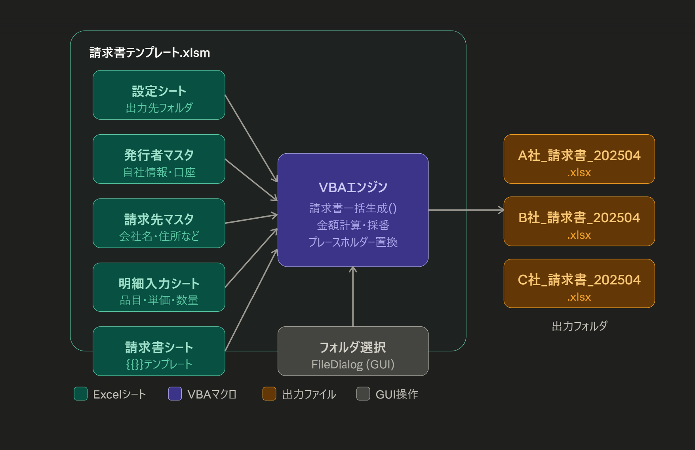

# 請求書自動作成ツール（Excel VBA）

## 概要
Excel VBA で動作する請求書の一括自動生成ツールです。
明細入力シートに請求データを入力するだけで、請求先ごとに .xlsx ファイルを自動出力します。

## 必要環境
- Microsoft Excel 2016以降
- Microsoft Word 2016以降

## 使い方
1. 請求書テンプレート.xlsmを開く
2. 明細入力シートに情報を入力する
3. 設定シートで出力先を指定する
4. 「請求書生成」ボタンをクリック

# 開発者
渡部 裕和  
VBAエキスパート スタンダードクラウン保持  
https://hirokazu-watabe.jp
